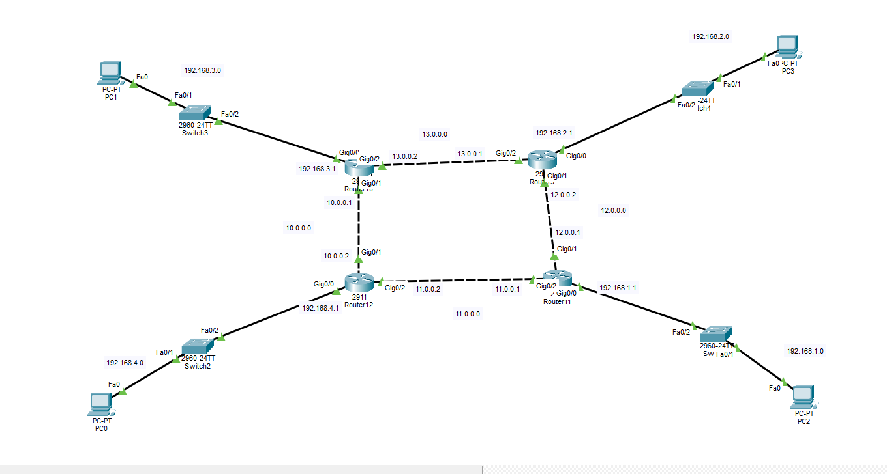
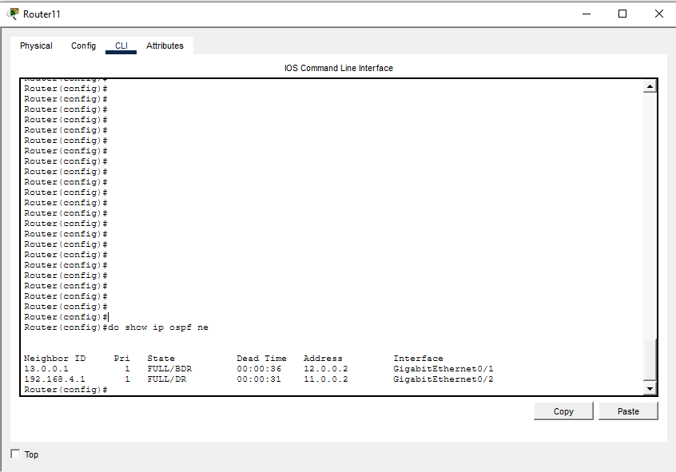
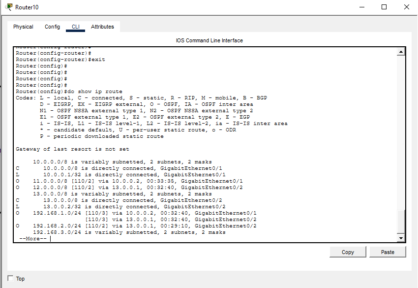
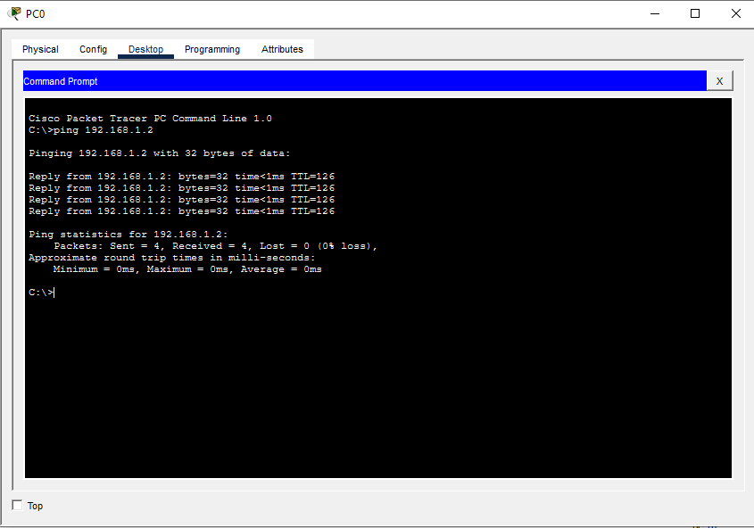

# OSPF Full Mesh Network Lab

## Overview
This project demonstrates the implementation of OSPF dynamic routing using Cisco Packet Tracer.

## Topology
The network consists of:
- 4 Routers
- 4 LANs
- Full Mesh Router Connectivity
- OSPF Area 0

## Network Addressing

| LAN | Network |
|------|---------|
| LAN 1 | 192.168.1.0/24 |
| LAN 2 | 192.168.2.0/24 |
| LAN 3 | 192.168.3.0/24 |
| LAN 4 | 192.168.4.0/24 |

## Verification

### Network Topology


### OSPF Neighbors


### Routing Table


### Connectivity Test


## Commands Used

```bash
show ip route
show ip ospf neighbor
show ip protocols
show ip interface brief
```

## Author

Mohamed Amr
